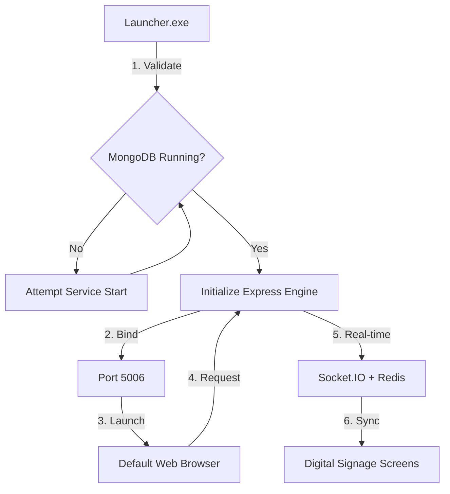
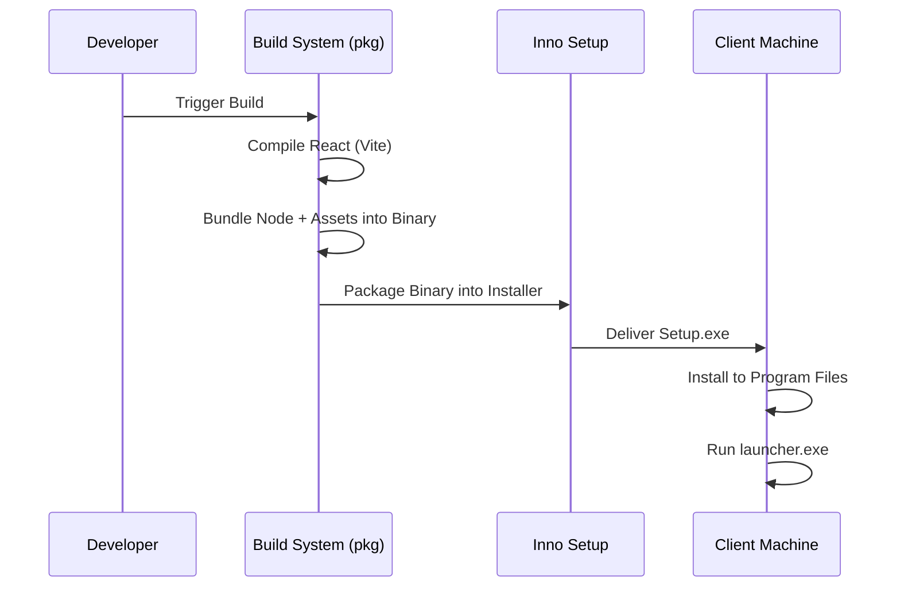
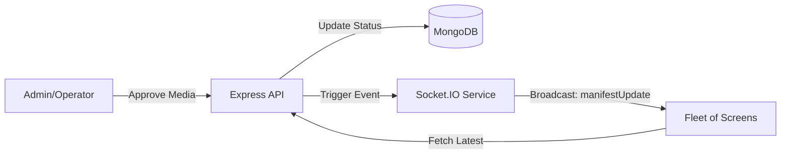

# 🛠 SRE OPERATIONS & RELIABILITY GUIDE
**Project:** Nexus Digital Signage System  
**Version:** 1.0.0  
**Stack:** Node.js (Express), React (Vite), MongoDB, Redis, Socket.IO  
**Status:** Production-Ready (Desktop Distributed)

---

## 1. System Architecture Overview
The system follows a distributed client-server architecture packaged as a single-binary desktop service.

### 1.1 Architectural Workflow

*   **Application Core:** Node.js Express engine handling REST APIs and state management.
*   **Real-Time Layer:** Socket.IO utilizing a Redis adapter for high-concurrency event broadcasting.
*   **Persistence:** MongoDB for document-based storage of media metadata and system configurations.
*   **Frontend:** React single-page application (SPA) served statically via the backend engine.
*   **Orchestrator (Launcher):** A specialized Node.js wrapper that manages process lifecycles and service dependencies.

---

## 2. Service Level Objectives (SLOs)
To maintain enterprise-grade reliability, the following targets are established:

*   **Availability:** 99.9% uptime for the local signage engine.
*   **Latency:** < 200ms for internal API calls; < 500ms for real-time manifest synchronization.
*   **Resiliency:** The system must automatically recover from database service interruptions without manual intervention.

---

## 3. Reliability & Self-Healing Mechanisms
The system implements "Defense in Depth" through the `launcher.js` bootstrap sequence:

### 3.1. Dependency Validation (Pre-flight)
Before the Express engine initializes, the launcher performs a TCP handshake with `localhost:27017`. 
*   **Action on Failure:** If MongoDB is unreachable, the launcher attempts to invoke the OS-level service manager (`net start` on Windows / `brew services` on macOS).
*   **Failure Threshold:** If the service fails to start after invocation, the system logs a `CRITICAL_FATAL` error and halts to prevent data corruption.

### 3.2. Automatic Update Lifecycle
On every launch, the system performs an asynchronous version check against the remote repository. 
*   **Update Strategy:** If a version mismatch is detected, the user is redirected to the verified binary distribution URL, ensuring the fleet remains synchronized with security patches.

---

## 4. Monitoring & Observability
Monitoring is categorized into three distinct layers:

### 4.1. Audit Logging (Transactional)
Located in `server/src/controllers/auditController.js`, all sensitive operations (media deletion, role changes, screen resets) are persisted to the `AuditLog` collection.
*   **Tracing:** Every audit log includes IP Address, User-Agent, and Timestamp for forensic analysis.

### 4.2. Heartbeat Monitoring
The `socketService.js` implements a heartbeat protocol. 
*   **Stale Screen Cleanup:** A background worker in `server.js` checks every 30 seconds for screens that haven't pinged in >60 seconds. These are automatically marked as `offline` in the state engine.

### 4.3. Health Endpoints
*   `GET /api/health`: Returns 200 OK if the engine is running.
*   `GET /api/screens/live-status`: Provides a real-time snapshot of the connected fleet.

---

## 5. Deployment & Rollout Strategy
The system utilizes a **Single-Binary Immutable Deployment** pattern.

### 5.1 Deployment Pipeline

1.  **Build:** React frontend is compiled to a production-optimized `dist/` folder.
2.  **Package:** The `pkg` utility bundles the Node.js runtime and all assets into a platform-specific binary.
3.  **Install:** The Inno Setup script packages the binary and dependencies into a standard Windows installer, providing a predictable environment on host machines.

---

## 6. Security Posture
*   **RBAC (Role-Based Access Control):** Enforced at the middleware level in `authMiddleware.js`.
*   **Rate Limiting:** Protects against local brute-force or API abuse.
*   **Threat Detection:** Logs and rejects attempts to bypass roles via forged headers (e.g., `X-User-Role`).
*   **Stateless JWT:** All identity verification is handled via signed JSON Web Tokens with versioned revocation support.

---

## 7. Incident Response & Failure Modes
| Scenario | Detection | Mitigation |
| :--- | :--- | :--- |
| **Database Down** | Launcher validation failure | Auto-start command via `launcher.js` |
| **WebSocket Drop** | `disconnect` event in store | Automatic exponential backoff reconnection |
| **Disk Pressure** | Upload failure logs | Manual purge of `server/uploads/` (Maintenance task) |
| **Port Conflict** | Port 5006 bind error | Launcher notifies user; kill conflicting process |

---

## 8. Capacity Planning
The system is optimized for:
*   **Concurrent Screens:** Up to 1,000 screens per local engine instance (Redis-backed).
*   **Media Storage:** Limited only by host machine disk space.
*   **Database:** MongoDB storage limits apply; recommended periodic audit log rotation for high-traffic environments.

---

## 9. Content Synchronization Flow (Real-time)

---
**Maintenance Contact:** Nexus SRE Team  
**Last Updated:** April 27, 2026
